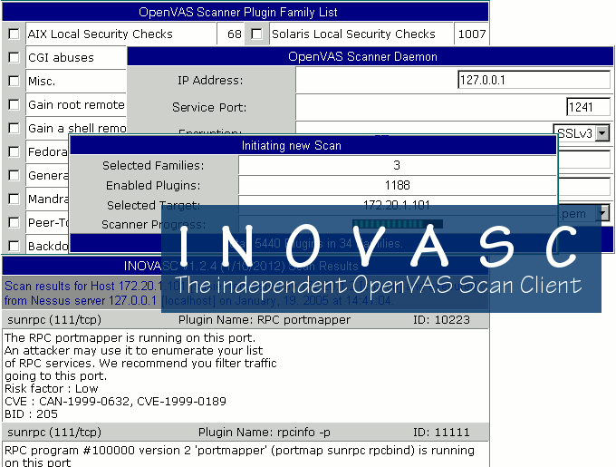

## INOVASC - Independend OpenVAS Client

1/10/2012 Frank4DD (support@frank4dd.com)

For some years I had been working on NessusWC - a Web
frontend for executing scans with Nessus. When Nessus
went commercial in 2008, it has been forked over into
OpenVAS. Therefore, NessusWC has been adapted to work
with the OpenVAS scanner and it was renamed to INOVASC
, the __IN__ dependent __O__ pen __VAS__ __S__ can __C__ lient.

The idea to write the NessusWC client came in 2004 out
of the need to manage a Nessus scanner farm with a unified
and SIMPLE client accessible from anywhere, regardless of
the OS platform. Existing web-based Nessus clients weren't
easy to set up, and their usage was overly complicated.

### Design Goals:

* Create a OpenVAS client software package that can be
compiled and installed independently of OpenVAS.

* The web interface should rely purely on CGI technology
and be as simple and robust as possible.

### Prerequisites:

* OpenSSL library and headers
* libcgic library and headers

### Configuration:

Apart from the Makefiles in the root and src/ directories, 
check the file nessuswc.h in the src/ directory. the upper
section can be configured to set the URL location and the
default nessus login parameters.

### Compilation:

INOVASC depends on the OpenSSL libraries and on libcgic
from www.boutell.com.

Common compilation problems are:
Installing libcgic or openssl libraries in a nonstandard path
and/or not setting /etc/ld.so.conf and running ldconfig.

You can work around it by setting the path to the includes/libs
explicit in the Makefile by adding the -I</path/to/includes>
and -L<path/to/libs> to the compiler options.

### Installation:

Add the cgi path to the webservers configuration, i.e. for apache
1.3 add a line like this to httpd.conf:

`ScriptAlias /inovasc/cgi-bin/ "/var/apache/htdocs/inovasc/cgi-bin/"`
or where the inovasc web home directory has been set up.

The software is compiled with a "default" OpenVAS server IP, port
(9391) and a openvassd scan user using client certificate
authentication.
Create this user on the openvassd server using <openvas-home>/sbin/
openvas-mkcert-client. Copy the generated client certificate
to the /path/to/inovasc/etc directory and make it readable to the
webserver.
Also, you'll need to create a /path/to/inovasc/results directory that
is writeable by the webserver. A detailled description can be found
at http://fm4dd.com/sw/inovasc/install.htm. 

### Security:

It is highly adviseable to add a webserver directive and file system
access control to prevent the /path/to/inovasc/etc directory
from being displayable or otherwise accessible as the certificate also
contains the private key.
The same is true for the writeable /path/to/inovasc/results directory, it
should be secured (i.e. by a Apache <Directory> directive).
The client certificate should be generated to match the IP/DNS name
of the client and certificate verification settings should be set
strict in nessusd.conf. 

Comments, help, bugfixes or enhancements and requests are always
welcome under <support@frank4dd.com>.

See also http://fm4dd.com/sw/
